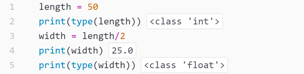

## For now, I am building this page as a random collection of things I learnt about Python. At the same time, I am trying to find out the best way to display code from Rmarkdown. 
&nbsp;  
 - An **if** cycle with the **elif** option.
```
# Assign value six to the variable x
x = 6
# An if cycle
if x < 2 :
    print('tiny')
elif x < 10 :
    print('medium')
else :
    print('large')
```
- On Python 3, a **division** output is always a **float** type number even if all numbers involved are integers. Here is an example in which code is compiled using the package Hydrogen in the text editor ATOM. Hydrogen allows to display in-line output. 

