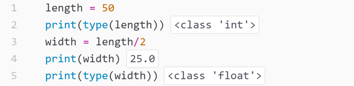

```{r setup, include=FALSE}
knitr::opts_chunk$set(hold = TRUE ) 
```


```{r, echo=FALSE}
library('reticulate')
```

## For now, I am building this page for fun as a random collection of things I learnt about Python. At the same time, I am trying to find out the best way to display code from Rmarkdown.

For Rmarkdown fans, how cool, I'm showing the Python code and its output (the lines starting with ##) by including the code directly into the Rmarkdown file. In other words, the Python output is rendered when this document is compiled. 
&nbsp;  

 - An **if** cycle with the **elif** option. First, I assign the value 6 to the variable x.
```{python}
x = 6
if x < 2 :
    print('tiny')
elif x < 10 :
    print('medium')
else :
    print('large')
```

- On Python 3, a **division** output is always a **float** type number even if all numbers involved are integers. 
```{python, collapse = TRUE}
length = 50
width = length/2
print(type(length))
print(width)
print(type(width))
```

Here is the same code compiled using the Hydrogen package in ATOM (text editor). Hydrogen allows to display in-line output. 

